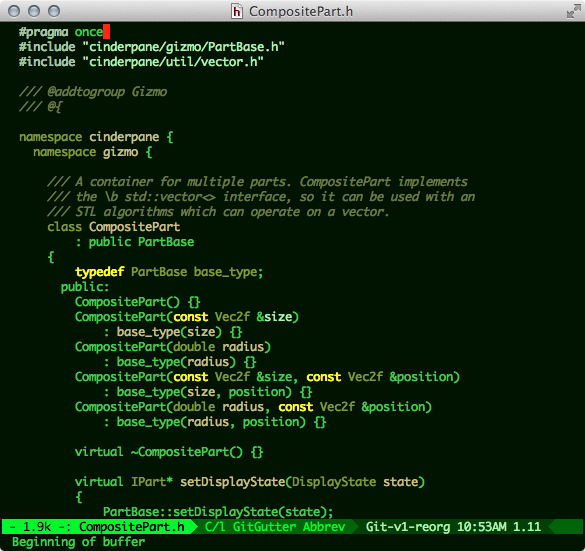

A retro color theme for Emacs. Because the true color of computing is
phosphorescent green on black.

### Screenshot



### Installation

#### From MELPA

If you've configured Emacs 24's `package.el` package manager to load
from the [MELPA](http://melpa.org/) package archive, it can be
installed simply thus:

```
M-x package-install RET green-phosphor-theme RET
```

#### Manually

Alternatively, To use it,
[download green-phosphor-theme.el](/green-phosphor-theme.el) to
a directory in your load-path, then put the following in your Emacs
configuration file:

```emacs-lisp
(load-theme 'green-phosphor t)
```
